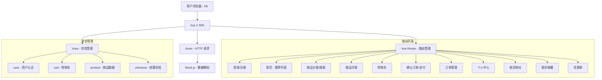
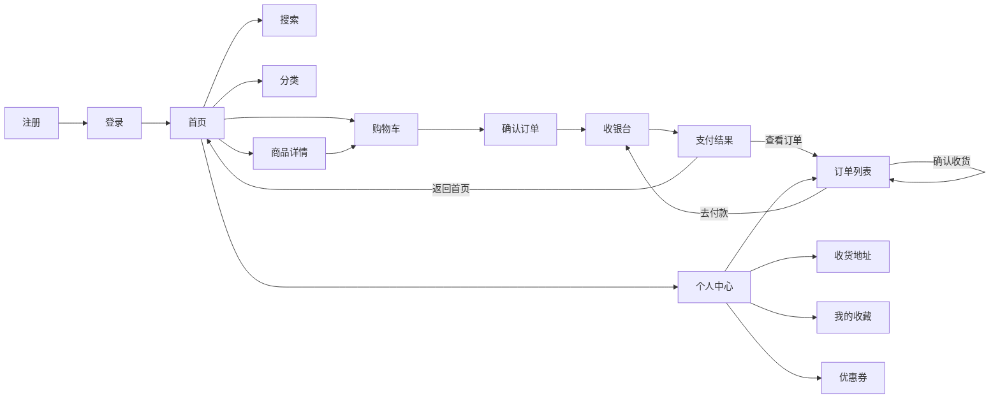
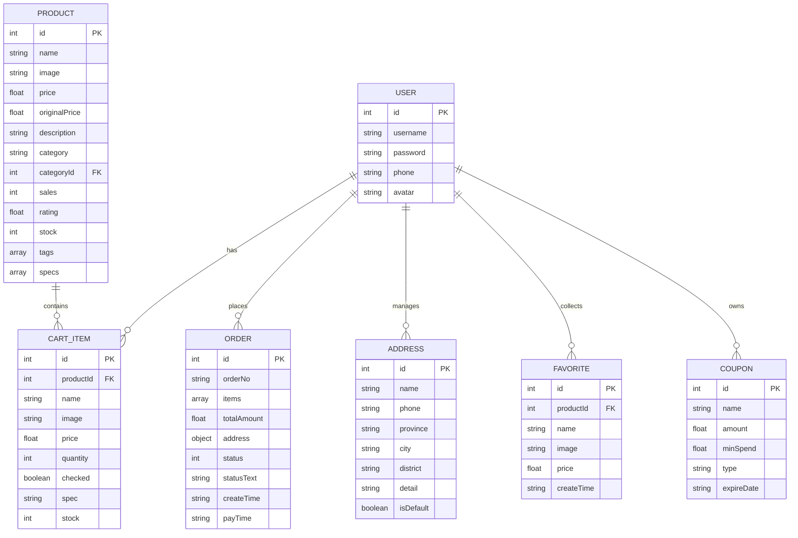
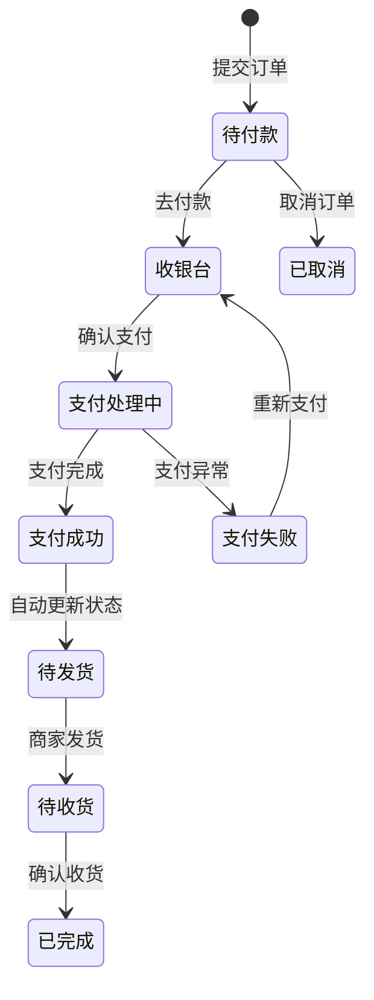
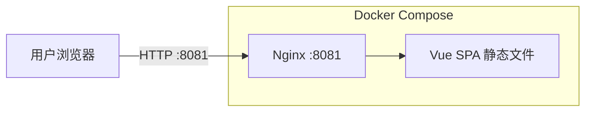

# 移动端电商 H5 客户端 - 项目设计文档

## 1. 系统架构

## 2. 技术栈

| 技术 | 版本 | 用途 |
|------|------|------|
| Vue | 2.7 | 前端框架 |
| Vue Router | 3.x | SPA 路由管理 |
| Vuex | 3.x | 全局状态管理 |
| Vant | 2.x | 移动端 UI 组件库 |
| Axios | 0.27 | HTTP 请求封装 |
| Mock.js | 1.1 | 后端数据模拟 |
| SCSS | - | CSS 预处理器 |
| Docker + Nginx | - | 容器化部署 |

## 3. 页面结构与路由

### 路由配置

| 路径 | 页面 | 需要登录 | 显示 TabBar |
|------|------|----------|-------------|
| `/home` | 首页（推荐列表、轮播图、分类入口） | 否 | 是 |
| `/category` | 商品分类（左侧分类 + 右侧商品列表） | 否 | 是 |
| `/cart` | 购物车 | 是 | 是 |
| `/profile` | 个人中心 | 是 | 是 |
| `/login` | 登录 | 否 | 否 |
| `/register` | 注册 | 否 | 否 |
| `/product/:id` | 商品详情 | 否 | 否 |
| `/search` | 搜索 | 否 | 否 |
| `/checkout` | 确认订单 | 是 | 否 |
| `/payment` | 收银台（选择支付方式、处理支付） | 是 | 否 |
| `/pay-result` | 支付结果（成功/失败） | 是 | 否 |
| `/orders` | 我的订单 | 是 | 否 |
| `/address` | 收货地址管理 | 是 | 否 |
| `/favorites` | 我的收藏 | 是 | 否 |
| `/coupons` | 优惠券 | 是 | 否 |

## 4. 数据模型

## 5. Vuex 状态管理

### user 模块
管理用户认证状态，token 和用户信息持久化到 localStorage。

| 类型 | 名称 | 说明 |
|------|------|------|
| state | token | 用户登录令牌 |
| state | userInfo | 用户基本信息 |
| getter | isLoggedIn | 是否已登录 |
| getter | username | 当前用户名 |
| action | login | 登录并保存凭证 |
| action | register | 用户注册 |
| action | logout | 退出登录并清除状态 |

### cart 模块
管理购物车数据，支持增删改查和全选操作。

| 类型 | 名称 | 说明 |
|------|------|------|
| state | items | 购物车商品列表 |
| getter | totalCount | 商品总数量 |
| getter | checkedItems | 已勾选商品 |
| getter | checkedTotal | 已勾选商品总价 |
| getter | isAllChecked | 是否全选 |
| action | fetchCart | 获取购物车列表 |
| action | addItem | 添加商品到购物车 |
| action | updateItem | 更新购物车项 |
| action | removeItem | 删除购物车项 |
| action | toggleCheckAll | 全选/取消全选 |

### product 模块
管理商品相关数据，包括轮播图、分类、推荐列表和商品详情。

| 类型 | 名称 | 说明 |
|------|------|------|
| state | banners | 轮播图列表 |
| state | categories | 分类列表 |
| state | recommendList | 推荐商品列表 |
| state | productList | 分类商品列表 |
| state | currentProduct | 当前商品详情 |
| action | fetchBanners | 获取轮播图 |
| action | fetchCategories | 获取分类 |
| action | fetchRecommend | 获取推荐商品 |
| action | fetchProducts | 按分类获取商品 |
| action | fetchProductDetail | 获取商品详情 |

### checkout 模块
管理结算流程中的临时数据。

| 类型 | 名称 | 说明 |
|------|------|------|
| state | items | 待结算商品列表 |
| mutation | SET_ITEMS | 设置结算商品 |
| mutation | CLEAR | 清空结算数据 |

## 6. 接口清单（Mock）

### 认证模块

| 方法 | 路径 | 说明 |
|------|------|------|
| POST | `/api/auth/login` | 用户登录 |
| POST | `/api/auth/register` | 用户注册 |

### 商品模块

| 方法 | 路径 | 说明 |
|------|------|------|
| GET | `/api/banners` | 轮播图列表 |
| GET | `/api/categories` | 分类列表 |
| GET | `/api/products/recommend` | 推荐商品（首页） |
| GET | `/api/products?categoryId=&keyword=&page=&pageSize=` | 商品列表（分类筛选/搜索） |
| GET | `/api/products/:id` | 商品详情 |

### 购物车模块

| 方法 | 路径 | 说明 |
|------|------|------|
| GET | `/api/cart` | 获取购物车 |
| POST | `/api/cart` | 添加到购物车 |
| PUT | `/api/cart/:id` | 更新购物车项（数量/选中） |
| DELETE | `/api/cart/:id` | 删除购物车项 |
| PUT | `/api/cart/check-all` | 全选/取消全选 |

### 订单模块

| 方法 | 路径 | 说明 |
|------|------|------|
| POST | `/api/orders` | 创建订单 |
| GET | `/api/orders?status=` | 订单列表（按状态筛选） |
| PUT | `/api/orders/:id/cancel` | 取消订单 |
| PUT | `/api/orders/:id/pay` | 支付订单 |
| PUT | `/api/orders/:id/confirm` | 确认收货 |

### 地址模块

| 方法 | 路径 | 说明 |
|------|------|------|
| GET | `/api/addresses` | 获取地址列表 |
| POST | `/api/addresses` | 新增地址 |
| PUT | `/api/addresses/:id` | 编辑地址 |
| DELETE | `/api/addresses/:id` | 删除地址 |

### 收藏模块

| 方法 | 路径 | 说明 |
|------|------|------|
| GET | `/api/favorites` | 收藏列表 |
| POST | `/api/favorites` | 添加收藏 |
| DELETE | `/api/favorites/:productId` | 取消收藏 |
| GET | `/api/favorites/check/:productId` | 检查是否已收藏 |

### 优惠券模块

| 方法 | 路径 | 说明 |
|------|------|------|
| GET | `/api/coupons?type=` | 优惠券列表（available/used/expired） |

## 7. 订单状态流转

| 状态码 | 状态 | 可执行操作 |
|--------|------|-----------|
| 0 | 待付款 | 取消订单、去付款 |
| 1 | 待发货 | - |
| 2 | 待收货 | 确认收货 |
| 3 | 已完成 | - |
| 4 | 已取消 | - |

## 8. UI/UX 规范

- 主色调：`#1AAD19`（清新绿）
- 辅助色：`#FF6B35`（活力橙，用于价格/促销）
- 背景色：`#F5F5F5`
- 卡片背景：`#FFFFFF`
- 文字主色：`#333333`
- 文字次色：`#999999`
- 字体：系统默认字体栈
- 卡片圆角：`8px`
- 间距体系：`8px / 12px / 16px / 24px`
- 设计宽度：`375px`（iPhone 标准）

## 9. 部署架构

- 使用 Docker 多阶段构建：Node.js 构建 → Nginx 托管静态文件
- Nginx 配置 SPA history 模式 fallback（所有路由回退到 `index.html`）
- 生产端口：`8081`
- 开发模式：`vue-cli-service serve`（端口 8081）
